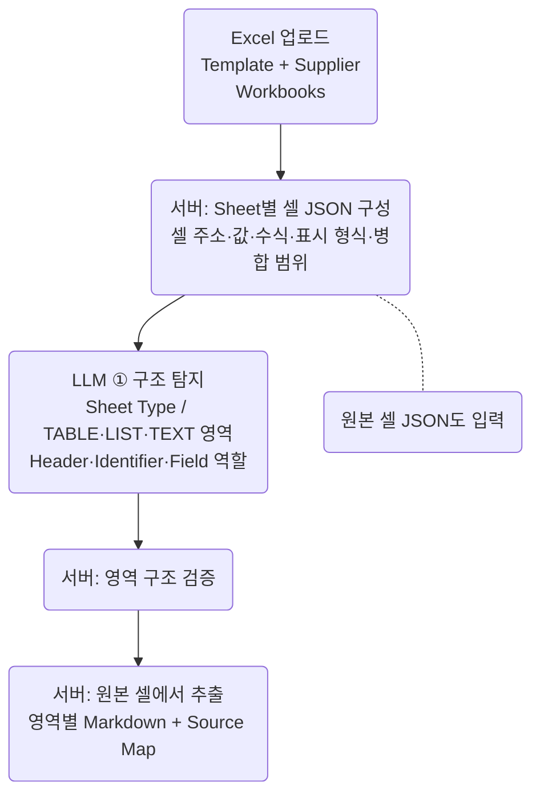

갱신: 2026-09-11 10:06:09 KST (UTC+09:00)

# Mermaid 렌더링 추가 방안

상태: 1차 구현 완료. 아래 내용은 초기 계획 기록이며 현재 기능 계약은 `SPEC.md`, 실행 결과는 `TEST_RESULTS.md`를 기준으로 한다. 채택: Mermaid 12.0.0·DOMPurify 3.4.15·기존 Milkdown 7.22.1. 구현 조정: 스타일은 `mermaid.css`로 분리, 사용자 frontmatter/init 설정은 앱 설정으로 고정, 블록별 색상 classDef/style은 허용. 분할 편집·내보내기·ELK 설정은 후속 범위로 유지한다.

**권장안: Markdown의 Mermaid 코드 블록을 보존하고, 렌더링 모드에서 Folio 전용 테마의 SVG 다이어그램으로 표시한다.** 초기 범위는 자동 렌더링·원문 수정 이동·확대 보기·오류 복구. 서버·AI 호출 없이 기존 WebView2에서 오프라인 실행한다.

## 1. 현재 구조와 적용 지점

| 확인 사항 | 설계 반영 |
|---|---|
| `SPEC.md`는 Mermaid 전용 시각 편집을 범위 밖으로 명시; `web/package.json`에 Mermaid 없음 | 새 의존성·기능 계약을 구현 완료 시 반영 |
| `web/src/main.ts`: Milkdown/ProseMirror 렌더링, CodeMirror 원문, `syncPlugin.props.nodeViews` 사용 | 기존 `code_block`의 표시를 NodeView로 확장 |
| Milkdown `code_block`: `language` 속성·텍스트 내용 저장, Markdown `code`로 직렬화 | 저장 대상은 Mermaid 문자열; SVG·확대율·표시 상태는 문서에 저장하지 않음 |
| `flushRendered()`는 문서 변경 시 전체 직렬화; 편집 없는 전환은 원문 유지 | 렌더링 완료·테마·확대가 편집 transaction을 발생시키지 않도록 분리 |
| `switchMode()`·`renderedCursor()`는 제목 기준 이동 | Mermaid 블록 위치를 지정하는 원문 이동 경로 추가 |
| `web/vite.config.ts`: 모든 `node_modules`를 `editor-vendor`로 병합 | Mermaid와 관련 의존성이 초기 편집기 번들에 합쳐지지 않도록 분할 검증 |
| `web/index.html`: 로컬 스크립트·폰트, iframe 금지 CSP | 로컬 번들 기반 SVG 표시; iframe 기반 렌더링은 채택하지 않음 |

## 2. 첨부 이미지 기반 시각 규격

이미지는 디자인 참고 자료로 사용한다. 이미지 내부의 Excel·서버·LLM 문구는 다이어그램 예시 내용이며 Folio 기능 요구로 해석하지 않는다. 아래 수치는 초기 디자인 목표이며 실제 화면 검증 후 조정한다.

| 요소 | 기본 표현 |
|---|---|
| 배경 | 밝은 테마 흰색, 어두운 테마 기존 `--paper`·`--surface` 연동 |
| 노드 | 흰색 바탕·연회색 1px 윤곽선·둥근 모서리 10–12px; 의미가 있는 마름모·원 등 원래 도형 유지 |
| 글자 | Segoe UI / Malgun Gothic / sans-serif, 16px, 진회색; 한글·영문 혼합, 중앙 정렬·여러 줄 지원 |
| 연결선 | 중간 회색 1–1.2px, 절제된 화살표·완만한 곡선; 실선·점선 등 원문 의미 유지 |
| 배치 | `flowchart TB` 기준 노드 간격 36px·단계 간격 56px·내부 여백 16px를 시작값으로 검증 |
| 본문 표시 | 기존 본문 폭 안에 배치, 바깥 여백 24px. 자연 크기보다 불필요하게 확대하지 않음 |
| 큰 그림 | 폭 맞춤과 100% 보기 제공. 긴 세로 그림은 문서 스크롤 유지; 작은 글씨는 확대 모달에서 확인 |
| 조작 UI | 상단에 작은 `Mermaid` 표시·`원문 수정`·`확대` 버튼. hover와 키보드 focus에서 선명하게 표시 |
| 확대 모달 | 가용 화면의 약 90%, 25–300% 확대·축소·폭 맞춤·100%, 스크롤 이동, Esc 닫기·원래 초점 복원 |

`theme: 'base'`와 `themeVariables`로 색·폰트를 지정하고, 필요한 둥근 사각형 스타일만 다이어그램 내부로 한정한다. `classDef`·`style`로 명시한 사용자 스타일은 허용되는 범위에서 우선한다. 자동 배치는 원문 그래프·줄바꿈에 따라 달라지므로 첨부 이미지와 픽셀 단위 동일 배치는 보장하지 않는다. [Mermaid 테마 설정](https://mermaid.js.org/config/theming.html)

## 3. 기능 SPEC — 제안

| ID | 계약 |
|---|---|
| M01 인식 | Markdown AST의 코드 블록 중 언어가 `mermaid`인 항목만 렌더링. 대소문자 비교는 정규화하되 저장 언어는 유지. 일반 코드·인라인 코드·문서 HTML은 기존 처리 유지 |
| M02 표시 | 렌더링 모드에서 블록마다 독립 SVG 표시. 1차 품질 보장: flowchart/graph·sequenceDiagram·classDiagram·stateDiagram-v2·erDiagram. 기타 형식은 지원 확대 전 원문과 안내 표시 |
| M03 편집 | `원문 수정` → 해당 코드 블록 본문으로 CodeMirror 커서·스크롤 이동 → 기존 `렌더링` 전환으로 결과 확인. 블록별 분할 편집기는 후속 범위 |
| M04 문서 계약 | 보기·확대·테마 전환은 text·revision·dirty·Undo 이력을 변경하지 않음. 원문 편집은 기존 공통 이력·저장·복구 사용 |
| M05 보존 | 편집 없는 전환은 기존 원문 그대로 유지. 본문 시각 편집 후에도 Mermaid 언어·코드 내용·주석 유지. fence 종류·주변 공백은 기존 serializer 정책에 따라 정규화 가능. 추가 fence metadata는 현재 스키마가 보존하지 않아 별도 보존 설계 전 보장 제외 |
| M06 오류 | 잘못된 구문은 해당 블록에만 오류 요약·확인 가능한 줄 위치·원문 수정 버튼 표시. 오류 줄을 얻지 못하면 위치를 추측하지 않음. 문서 나머지 편집·저장 허용 |
| M07 상태 | 대기·렌더링 중·완료·오류·제한 초과 상태 구분. 재렌더 중 이전 그림을 유지한다면 `업데이트 중` 표시; 실패 시 오래된 그림을 최신 결과로 표시하지 않음 |
| M08 테마 | 기존 host `theme` 메시지로 현재 그림을 재렌더링. 본문 줄 높이 설정이 SVG 라벨의 줄 높이·노드 크기를 임의로 바꾸지 않도록 스타일 격리 |
| M09 접근성 | 버튼 이름·키보드 접근·초점 표시, SVG 접근 가능한 이름·설명, 모달 초점 관리 제공. 다이어그램 앞뒤 문단으로 커서 이동·블록 선택/삭제 가능 |
| M10 오프라인 | Mermaid·필요한 렌더러·스타일을 배포 Web 자산에 동봉. CDN·외부 폰트·외부 이미지·외부 아이콘 요청 없이 동작 |
| M11 입력 처리 | `securityLevel: 'strict'`, `startOnLoad: false`, HTML 라벨 비활성화를 기본으로 적용. 문서의 설정 지시문이 보안·리소스 제한을 해제하지 못하도록 보호. 링크·callback·이벤트 속성·외부 리소스는 실행하지 않음 |
| M12 자원 제한 | 초기 제안: 블록 20,000자·연결선 200개 상한, 단일 렌더 큐, 화면 근처 블록 우선 처리. 초과 시 원문 보기 제공. 제한은 기준 PC 측정 후 확정 |

## 4. 구현 설계

1. **NodeView 연결:** `code_block`용 factory를 등록하고 Mermaid 여부로 분기한다. 일반 코드는 기존 `<pre><code>`와 편집 가능한 `contentDOM`을 유지한다. Mermaid는 비편집 SVG 표시 영역을 사용하며 `update`·`destroy`·`stopEvent`·`ignoreMutation`을 구현한다. 언어 전환·붙여넣기·선택·앞뒤 커서 이동도 처리한다.
2. **렌더 서비스:** 첫 Mermaid 표시 시 `import('mermaid')`를 실행한다. 앱 정책을 적용한 뒤 `mermaid.render(uniqueId, source)`로 SVG를 생성한다. 렌더 설정과 호출을 하나의 큐에서 관리해 다이어그램 간 테마 설정 경쟁을 막는다. [Mermaid API 사용](https://mermaid.js.org/config/usage.html)
3. **결과 수명:** 요청마다 `documentId + NodeView instance + generation`을 기록한다. 블록 삭제·문서 전환·테마 변경 뒤 도착한 결과는 폐기한다. 같은 내용의 복수 블록과 확대 모달에도 서로 다른 SVG ID를 부여한다. 캐시를 복제할 경우 marker·clipPath·ARIA 참조까지 ID를 재매핑한다.
4. **캐시·측정:** 키는 원문·테마·설정·렌더러 버전으로 구성한다. 초기 LRU 예산은 24개/8MB, 문서 전환 시 정리한다. 숨겨진 편집기의 0px 폭으로 렌더하지 않으며 `document.fonts.ready` 이후 크기를 계산한다. 컨테이너 폭 변경은 우선 viewBox 배율로 대응한다.
5. **정확한 원문 이동:** `flushRendered()` 이후 최신 AST에서 코드 블록의 위치·본문 시작 위치를 추출한다. ProseMirror 블록 순서와 AST 순서를 중첩 목록·인용까지 대응하고 내용을 재확인한다. 동일 Mermaid 문자열이 여러 번 나와도 단순 문자열 검색으로 위치를 결정하지 않는다. 대응 실패 시 원문 모드와 안내를 제공한다.
6. **안전한 SVG:** Mermaid의 strict 처리에 더해 반환 SVG의 실행 요소·이벤트 속성·외부 URL을 제거하는 검증된 정제 경로를 적용한다. `themeCSS` 등 사용자 설정은 허용 목록으로 제한하고 저장 원문은 수정하지 않는다. 기존 CSP를 완화하지 않고 시험한다. 오류 원문도 HTML로 삽입하지 않는다. [설정 우선순위](https://mermaid.js.org/config/configuration.html)
7. **줄바꿈:** 신규 예시는 Markdown 문자열의 실제 개행을 사용한다. 기존 ` ` 라벨의 표현은 선택 버전·`htmlLabels: false` 조합에서 별도 검증하고 미지원이면 원문 수정 안내를 제공한다. 줄바꿈을 위해 `securityLevel`을 낮추지 않는다. [Flowchart 문자열](https://mermaid.js.org/syntax/flowchart.html)

Mermaid 렌더링은 DOM 측정이 필요하므로 Web Worker로 즉시 이전하거나 `Promise.race`만으로 강제 중단할 수 있다고 가정하지 않는다. 초기에는 입력 상한·직렬 큐·가시 영역 우선 처리로 부담을 제한한다. 실제 UI 정지가 관측되면 별도 격리 렌더 경로를 후속 설계한다.

## 5. 변경 파일

| 파일 | 작업 |
|---|---|
| `web/src/mermaid-renderer.ts` 신규 | 지연 로딩·설정·렌더 큐·결과 검증·캐시·오류 분류 |
| `web/src/mermaid-node-view.ts` 신규 | 코드 블록 분기·SVG 카드·툴바·노드 수명 관리 |
| `web/src/mermaid-viewer.ts` 신규 | 확대 모달·배율·초점·접근성 |
| `web/src/main.ts` | NodeView 등록·원문 이동·테마 통지·문서 전환 정리 |
| `web/src/document.ts` | 코드 블록 AST 위치 조회 확장; 기존 heading·image 결과 유지 |
| `web/src/style.css`, `web/index.html` | 카드·모달·다크 테마·SVG 스타일 격리; CSP 호환성 확인 |
| `web/package.json`, `web/package-lock.json`, `web/vite.config.ts` | Mermaid·필요한 직접 의존성 고정, 실제 지연 로딩 청크 분리 |
| `web/tests/`, `src/Folio/SmokeTest.cs` | 회귀·시각·실제 WebView2 통합 검증 |
| `SPEC.md`, `README.md`, `THIRD-PARTY-NOTICES.md` | 완료 기능·지원 문법·제약·라이선스 갱신 |

초기 기능은 기존 테마 메시지와 저장 경로를 사용하므로 C# 제품 기능·호스트 프로토콜 확장은 필요하지 않을 것으로 판단한다. SVG/PNG 파일 저장을 추가할 때는 별도 저장 명령·파일 선택 처리가 필요하다.

## 6. 구현 순서·완료 기준

| 단계 | 산출물·통과 조건 | 예상 작업량 |
|---|---|---|
| 1. 기술 검증 | Mermaid 정확한 버전 고정; 로컬 production 번들·CSP·WebView2에서 첨부형 flowchart, 한글 여러 줄, 밝음/어두움 렌더 확인; 번들 크기·첫 로딩 측정 | 0.5–1일 |
| 2. 핵심 통합 | NodeView·원문 이동·오류 상태·문서 수명·공통 Undo 연결. 렌더링만으로 dirty가 바뀌지 않음 | 1–1.5일 |
| 3. UI 완성 | 기본 테마·확대 모달·반응형·키보드 동작. 긴 노드·분기선·점선 잘림 없음 | 0.5–1일 |
| 4. 검증·문서 | 아래 검증 통과, SPEC·README·라이선스 갱신, 배포 자산 누락 없음 | 0.5–1일 |

예상 총 2.5–4.5 개발일. 1인 기준 계획 추정이며 버전 호환·한글 레이아웃 조정에 따라 변동한다. 새 설치파일 제작·배포는 별도 작업이다. 기본 배치는 Dagre를 명시하고, 복잡한 교차 그래프의 ELK 적용은 1단계 비교 후 후속 범위로 결정한다. Mermaid 주요 버전별 기본 테마·레이아웃·브라우저 요구가 달라질 수 있으므로 라이브러리 기본값에 의존하지 않는다.

| 검증 | 통과 기준 |
|---|---|
| 참조 스타일 | 첨부형 세로 흐름·한글/영문 여러 줄·원형 기호·점선·분기·긴 라벨이 밝음/어두움에서 읽히고 잘리지 않음 |
| 왕복·저장 | 무편집 전환·확대·테마 변경 뒤 text/revision/dirty 동일; 주변 본문 편집 후 코드 내용 유지; 실제 저장·재열기 결과 동일 |
| 편집·탐색 | 동일 내용의 복수 블록·중첩 목록·인용에서 정확한 원문 이동; 일반 코드 편집·공통 Undo/Redo·한글 IME 정상 |
| 비동기 | 렌더 중 문서 전환·블록 삭제·테마 변경에도 오래된 결과 미삽입; 복수 그림·모달의 ID/화살표 참조 충돌 없음 |
| 오류·입력 | 빈 블록·닫히지 않은 fence·잘못된 구문·제한 초과·지시문을 통한 보안 설정 변경·악성 HTML/SVG에 대해 문서 편집 유지, 외부 요청·스크립트 실행 없음 |
| 반응형 | 좁은 창·큰 그래프·DPI 100/150/200%에서 폭 맞춤·100%·확대·초점 복원 정상 |
| 성능·오프라인 | 기준 PC/WebView2 버전을 기록하고 20노드/30연결선 웜 렌더 p95 500ms 이하를 초기 목표로 측정. 20개 블록 문서의 입력 지연·메모리·콜드 로딩 별도 기록. 네트워크 차단 상태에서 배포 자산으로 렌더 성공 |

실행 검증: `npm test`, `npm run test:ui`, `npm run build`, 실제 Windows 호스트 통합 검증 완료. 확정 결과·환경·제약은 `TEST_RESULTS.md` 참조.

## 7. 스타일 검증용 Mermaid 예시

첨부 이미지에서 식별 가능한 흐름을 단순화한 시험 원문이다. 잘린 하단 흐름은 추정하여 추가하지 않았다. 색·폰트·간격은 Folio 테마가 제공한다.

후속 후보: 블록 내 원문/미리보기 분할·입력 후 250ms 실시간 갱신, Mermaid 삽입 템플릿, SVG/PNG 저장, ELK 배치, 추가 다이어그램 유형. 노드 드래그로 Mermaid 원문을 재작성하는 시각 편집은 별도 기능으로 설계한다.
