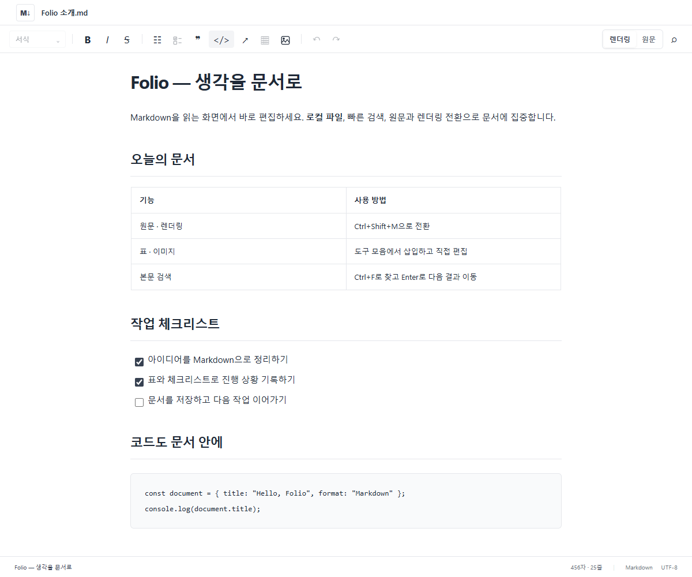
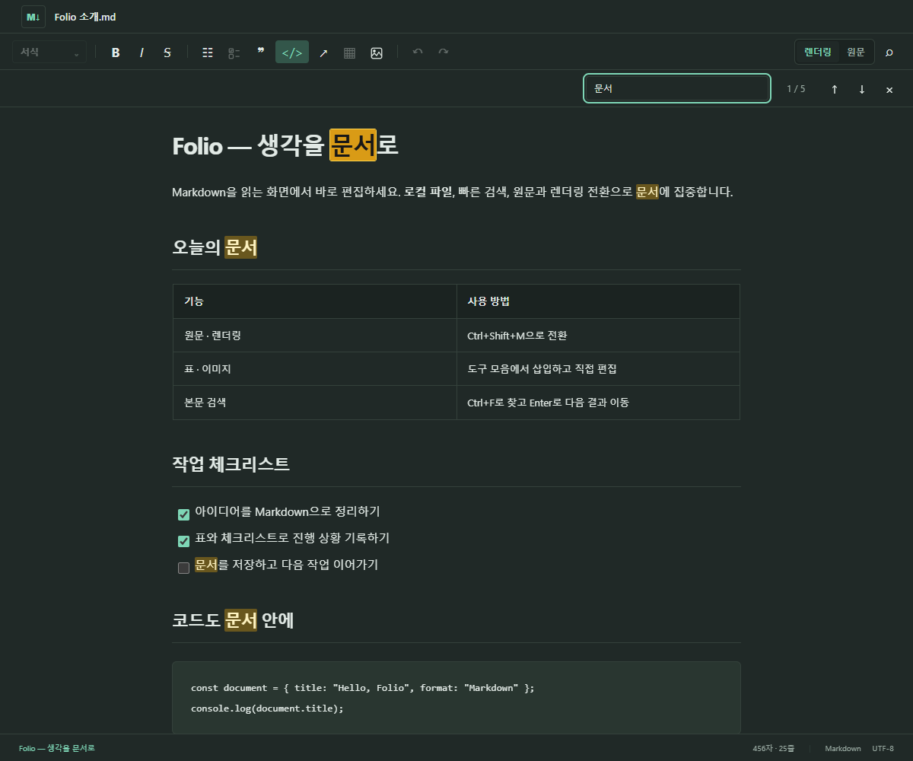

갱신: 2026-09-18 18:33:41 KST (UTC+09:00)

# Folio — Windows Markdown Editor

**문서를 읽는 화면에서 바로 편집하는 Windows용 오픈소스 Markdown 편집기.** 제목 목차로 이동하고, 원문과 렌더링을 전환하며 표·이미지·체크리스트·Mermaid 다이어그램을 다룬다. 문서는 로컬 파일로 저장하며 편집에 서버·로그인이 필요 없다.

**[Windows x64 설치파일 다운로드](https://github.com/bryanbaek75/folio/releases/latest/download/Folio-Setup-0.1.11-win-x64-online.exe)** · [전체 배포 파일·변경 내역](https://github.com/bryanbaek75/folio/releases/latest) · [빌드 방법](#개발-환경과-빌드) · [Apache-2.0 라이선스](LICENSE)

설치: EXE 실행 → 설치 → 시작 메뉴 **Folio**. 관리자 권한 불필요. .NET·Windows App SDK 포함, WebView2가 없는 PC에서만 최초 다운로드가 필요하다. Windows 11 x64 우선 검증. 현재 미서명 배포로 Windows 게시자 미확인·SmartScreen 안내가 표시될 수 있다.

## 화면

렌더링 편집 영역 — 제목·표·체크리스트·코드를 문서 안에서 편집한다. Windows 앱은 이 영역 왼쪽에 네이티브 제목 목차를 추가로 제공한다.



어두운 테마 — 렌더링 본문에서 검색 결과를 강조하고 이전·다음 결과로 이동한다.



## 주요 기능과 사용법

구성: C#·WinUI 3·WebView2, TypeScript·Milkdown·CodeMirror 6. 좌측 네이티브 제목 트리와 우측 원문/렌더링 편집을 제공한다.

Folio 0.1.11은 렌더링 본문 찾기와 작은 모서리 반경을 적용한다. 버튼 4·모드 전환 6·패널/대화상자 8, 로고 10 유지. 흰색 배경·회색 구분선·초록색 로고, 체크리스트·표 우클릭 복사, 제목 표시줄 Folio 아이콘, 이미지·코드·제목·표 편집, 크기 저장, 최근 문서 20개, Mermaid를 제공한다.

찾기: Ctrl+F 또는 돋보기. 렌더링 모드에서는 본문·제목·표·목록·일반 코드 텍스트를 대소문자 구분 없이 검색하고 `현재 / 전체`를 표시한다. 전체 일치는 노란색, 현재 일치는 진한 색으로 강조하며 서식을 가로지르는 문구도 지원한다. Enter/F3·↓는 다음, Shift+Enter/Shift+F3·↑는 이전, 끝에서 순환·자동 스크롤. Esc로 닫고 편집 복귀. 수정 시 재검색, 검색만으로 dirty·Undo 변경 없음. 원문 모드는 기존 CodeMirror 찾기를 유지한다. Mermaid 원문·이미지 내부 글자·보존 원문 노드는 렌더링 검색 대상이 아니다.

파일 경로: 상단 파일명 클릭 → 전체 경로 선택·Ctrl+C 또는 전체 경로 복사 버튼. 파일명 우클릭으로도 복사한다. Notepad 등 다른 앱에 Ctrl+V로 붙여넣는다. 저장 전 문서는 먼저 저장해야 경로가 생긴다.

Excel·표 복사: 셀 영역 드래그 → 우클릭 → 복사 또는 Ctrl+C. 선택 셀의 구조·서식은 HTML, 값은 탭 구분 텍스트로 기록해 Excel·텍스트 앱에 붙여넣는다. 단일 셀도 우클릭 복사 가능하며 문서·선택은 유지한다. Ctrl+X는 구조를 유지하고 내용만 지운다. 렌더링 Ctrl+V는 빈 공간에서 첫 행을 머리행으로 신규 표 생성, 기존 표에서는 현재 셀/선택 좌상단부터 반영·필요 행/열 확장. 단일 값은 선택 셀 전체 채움. 범위 밖 내용·열 너비·정렬 유지, Undo 지원. TSV 인용 개행·탭·따옴표·빈 셀 지원. Excel 병합은 좌상단 값·나머지 빈 셀로 풀고 수식은 표시 값 반영. 최대 256열·50,000셀·10MB.

체크리스트: 글머리 목록 옆 체크리스트 아이콘으로 렌더링 문단·목록 또는 원문 선택 줄을 전환한다. 다시 누르면 체크박스를 제거하고 일반 목록으로 유지한다. 혼합 선택의 기존 완료 상태·서식·번호·중첩은 보존한다. 체크박스 클릭으로 완료 전환, 내용 있는 항목에서 Enter는 미완료 항목 추가. 변환별 Undo/Redo 지원. 표·제목·코드·보존 블록 포함 선택은 변환하지 않는다.

이미지·코드: 상단 이미지 아이콘은 문서 저장창 없이 이미지 파일 선택창을 연다. 이미지 파일 복사/잘라내기 후 Ctrl+V, 스크린샷 붙여넣기를 지원한다. PNG·JPEG·GIF·WebP·BMP, 한 번에 16개·합계 20MB. 원본 파일은 유지하며 문서의 assets에 복사한다. 새 문서에서는 임시 보관·즉시 표시하고 첫 저장 시 이미지도 함께 복사한다. 복구·Undo/Redo 지원. 코드 블록 안에서 `</>` 버튼을 다시 누르거나 Ctrl+Alt+C로 본문 복원. 원문·렌더링 모두 내용·줄바꿈을 유지하며 Undo/Redo를 지원한다.

제목: 상단 선택기에서 본문·H1–H6 선택, Ctrl+Alt+0–6 지원. 원문·렌더링에서 현재/선택 문단에 적용하며 같은 레벨 재선택은 문서를 변경하지 않는다. 표·코드·보존 구간·강제 줄바꿈이 포함된 선택에서는 변환을 제한한다.

표: 삽입 버튼에서 8×8 빠른 크기 또는 총 2–100행·1–50열 지정. 렌더링에서 우클릭·Shift+F10으로 행·열·정렬·표 편집 메뉴를 연다. 표 위 중복 도구는 제거하고, 표 바깥 세로 여백은 일반 문단과 같은 15px로 맞춘다. 드래그/메뉴로 범위를 선택해 내용 지우기·행/열 삭제를 실행한다. 머리행·마지막 본문 행/열은 유지하며 표 전체 삭제는 우클릭 메뉴에서 실행한다. 열 정렬·너비는 구조 변경·저장·재열기에도 유지한다. 원문 표 삽입은 최상위 문단/제목/빈 줄에서 지원하고 표 구조 메뉴는 렌더링에서 사용한다.

크기 조절: 렌더링에서 표 열 경계를 드래그하거나 이미지를 선택해 손잡이·px 입력으로 조절한다. 이미지 원본 버튼은 자동 크기를 복원한다. 저장·재열기·Ctrl+Z/Ctrl+Y를 지원한다. 예제는 `examples/layout.md`에 동봉한다.

저장 형식: 표·이미지는 Markdown으로 유지하고 크기는 인접 `folio:table:v1`·`folio:image:v1` HTML 주석에 저장한다. 다른 뷰어에서는 기본 크기로 표시된다. 주석을 지우면 자동 크기로 복원된다. 표 주석은 표 바로 앞, 이미지 주석은 이미지 바로 뒤에 함께 이동해야 한다. 상세 계약: `SPEC.md` E05–E08.

| 실행 | 방법 |
|---|---|
| 한 파일로 설치 · 경량 권장 | [Setup EXE 다운로드](https://github.com/bryanbaek75/folio/releases/download/v0.1.11/Folio-Setup-0.1.11-win-x64-online.exe) → 설치 → 시작 메뉴 Folio. WebView2가 없을 때만 다운로드. 한국어 UI, 관리자 권한 불필요 |
| 포터블 ZIP | [Releases](https://github.com/bryanbaek75/folio/releases/latest)의 Windows x64 ZIP 압축 해제 → `Folio.exe` 실행. WebView2 필요 |
| 오프라인 설치 직접 빌드 | `./build.ps1 -Installer -RuntimeMode Offline`. WebView2 전체 설치 파일 동봉 |
| 바로 실행 | `artifacts/Folio-0.1.11-win-x64/Folio.exe` 실행. EXE 옆의 DLL·Assets·Web 폴더를 함께 유지 |
| 다른 PC로 복사 | `artifacts/Folio-0.1.11-win-x64` 폴더 전체 복사 후 `Folio.exe` 실행 |
| 설치 위치 | `%LOCALAPPDATA%/Programs/Folio`. 설치 화면에서 경로 변경 가능 |
| 바탕 화면 바로가기 | 설치 화면에서 선택 |
| Markdown 파일 연결 | 설치 시 연결 옵션 선택 → 완료 화면에서 기본 앱 설정 열기 → Folio를 .md·.markdown 기본 앱으로 선택. 우클릭 → Folio에서 편집도 지원 |
| 제거 | Windows 설정 → 앱 → 설치된 앱 → Folio Markdown Editor → 제거. 문서·설정·복구본 유지 |

대상: Windows 11 x64 우선 검증. 프로젝트 최소 플랫폼은 Windows 10 1809이며 해당 OS에서의 실행은 별도 확인이 필요하다. .NET·Windows App SDK는 앱에 포함한다. 경량 Setup EXE는 WebView2 Bootstrapper를 내장해 미설치 PC에서만 다운로드·설치한다. 오프라인 Setup EXE는 전체 runtime 설치 파일을 동봉한다. ZIP 버전은 WebView2가 없으면 [Microsoft WebView2 Runtime](https://developer.microsoft.com/en-us/microsoft-edge/webview2/) 설치가 필요하다. 로컬 편집에는 서버·로그인·인터넷이 필요 없다. 배포 형식은 Setup EXE·실행 폴더·ZIP이며 MSIX/Store 배포·코드 서명은 미적용이다. 설치 상세: `INSTALLER.md`.

| 기능 | 동작 |
|---|---|
| 문서 | 새 문서, UTF-8 `.md`·`.markdown`·`.txt` 열기, `.md` 저장·다른 이름 저장, 최근 문서 최대 20개 |
| 최근 문서 | 상단 최근 문서 버튼·Ctrl+Shift+O. 최근 20개, 파일명·전체 경로 줄바꿈 표시, 폴더/파일명 검색. 선택 후 열기·Enter·더블클릭, 재실행 복원 |
| 목차 | H1~H6·Setext 제목, 계층 접기·펼치기, 제목 검색, 클릭 이동, 우클릭 이름 변경 |
| 원문 | CodeMirror 구문 강조·줄 번호·찾기/바꾸기·자동 줄바꿈 |
| 렌더링 | 제목·강조·링크·인용·목록·코드·표·이미지 직접 편집, 체크박스 클릭 |
| Mermaid | mermaid 코드 블록을 한글 SVG 다이어그램으로 표시. 밝음/어두움, 원문 수정 바로 이동, 확대 모달·25–300%·100%·폭 맞춤·스크롤. 오류는 해당 블록에만 표시 |
| 편집 이력 | 원문·렌더링·트리 편집 공통 Undo/Redo; 연속 입력 그룹화; 최대 150개 및 문자 예산 제한 |
| 저장 안정성 | 임시 파일 기록 후 교체, 외부 수정 감지·충돌 선택, 마지막 저장본과 현재 문서 상태 비교 |
| 복구 | 변경 문서 3초 주기 복구본; 시작 시 복구 선택; 저장하지 않은 문서 종료 확인 |
| 이미지 | 상단 이미지 아이콘·더보기 메뉴에서 삽입; 문서 옆 `assets` 폴더에 복사; 다른 폴더로 저장 시 상대 이미지 복사·충돌 검사 |
| 화면 | 파일명을 상단 앱 바에 표시, 서식·모드 전환을 한 줄로 통합. 밝은/어두운 테마, 드래그로 목차 폭 조절, 목차 숨기기, 창 크기·테마 저장 |
| Configuration | 우측 상단 톱니바퀴 또는 더보기 → 설정. 본문·표 줄 높이 1.00–3.00배, 문서 왼쪽/가운데 배치, 목차 줄 높이 1.00–3.00배. 즉시 미리보기·저장·취소·기본값 복원 |

| 단축키 | 기능 |
|---|---|
| Ctrl+N / Ctrl+O | 새 문서 / 열기 |
| Ctrl+Shift+O | 최근 문서 목록: 파일명·전체 경로 검색, 선택 후 열기 |
| Ctrl+S / Ctrl+Shift+S | 저장 / 다른 이름 저장 |
| Ctrl+Shift+M | 렌더링 ↔ 원문 |
| Ctrl+Z / Ctrl+Y·Ctrl+Shift+Z | 실행 취소 / 다시 실행 |
| Ctrl+B / Ctrl+I | 굵게 / 기울임 |
| Ctrl+Alt+C | 코드 블록 적용 / 해제 |
| Ctrl+Alt+0 / Ctrl+Alt+1–6 | 본문 / H1–H6, 양쪽 모드 동일 |
| 표 안 Tab / Shift+Tab | 다음 / 이전 셀, 마지막 셀 Tab은 행 추가 |
| 표 안 Enter / Ctrl+Enter | 표 밖 새 문단 |
| 표 안 Shift+F10 | 표 편집 메뉴 |
| 셀 범위 선택 후 Delete / Backspace | 구조·너비·정렬 유지, 내용만 지우기 |
| Ctrl+F | 렌더링 본문 찾기 / 원문 찾기·바꾸기 |
| Ctrl+링크 클릭 | 기본 브라우저에서 http/https 링크 열기 |

원문 보존 정책: 편집 없는 모드 전환은 문서를 변경하지 않는다. 파일을 수정하지 않고 저장하면 원본을 유지한다. 수정 후 저장은 기존 파일의 BOM 유무·주요 개행 방식(CRLF/LF)을 유지한다. 렌더링 편집 후에는 전체 Markdown 직렬화 때문에 목록 기호·공백·강조 기호 등이 정규화될 수 있다. 목록·강조 기호 등 Markdown 표현을 직접 유지하려면 원문 모드를 사용한다. 수정 후 혼합 개행의 바이트 단위 보존은 보장하지 않는다.

HTML·참조 링크·front matter가 있어도 일반 본문은 렌더링에서 직접 편집한다. 독립된 `<br />`는 입력 가능한 빈 문단으로 복원한다. 기타 HTML·참조 토큰·메타데이터는 원문 보존 구간으로 표시하며 해당 구문 자체는 원문 모드에서 수정한다. HTML을 실행하지 않는다. 일반 Markdown과 GFM 표·취소선·체크리스트를 지원한다. Mermaid 노드 드래그 편집·SVG/PNG 내보내기, 수식·MDX 전용 편집, 섹션 드래그 이동, 다중 문서 탭은 현재 범위에 포함되지 않는다.

Mermaid 사용: 원문 모드에서 언어가 `mermaid`인 fenced 코드 블록을 작성하고 렌더링으로 전환한다. 카드의 원문 수정 버튼으로 해당 구문에 바로 이동한다. flowchart/graph·sequenceDiagram·classDiagram·stateDiagram-v2·erDiagram을 지원하며, 여러 줄 Markdown 문자열과 `<br/>` 라벨을 표시한다. 한 블록 20,000자·Mermaid 연결선 제한 200개, 화면 근처 우선 렌더링을 적용한다. 원문 자체를 저장하고 보기·테마·확대는 미저장 상태나 Undo를 변경하지 않는다. 문서의 frontmatter/init 설정은 앱 테마·보안 정책으로 고정하며 일반 classDef/style 색상 지정은 지원한다. 외부 이미지·아이콘·링크 실행은 지원하지 않는다. 복잡한 다이어그램의 UI 지연을 강제로 중단하는 기능은 없으며 추가 fence metadata의 시각 편집 왕복 보존은 보장하지 않는다.

현재 제약: UTF-8 파일만 열며 파일 크기는 10MB 이하로 제한한다. 대용량 문서의 지연·메모리는 보장하지 않는다. 모드 전환 위치는 제목 단위로 대응하므로 문자 단위 선택 영역은 동일하게 유지되지 않을 수 있다. 목차 ID는 원문 위치 기반이므로 앞부분 편집 시 일부 접힘 상태가 초기화될 수 있다. 외부 이미지는 자동 요청하지 않으며 문서 폴더 내부 상대 경로 이미지를 사용한다. 앱은 한 번에 한 인스턴스만 실행한다. 새 파일 열기 요청은 실행 중인 창에 전달하며, 미저장 변경은 저장·버리기·취소 확인 후 처리한다.

설정·최근 파일: `%LOCALAPPDATA%/Folio/settings.json`. Configuration에서 저장하면 재실행 시 복원한다. 기본값은 본문·표 1.95배, 목차 2.00배, 문서 가운데 배치. 목차 행 높이는 12px × 배수 + 고정 여백 8px이며 본문 문단 여백은 유지한다. 설정 변경은 Markdown 내용·dirty·Undo 이력에 영향을 주지 않는다. 복구본: `%LOCALAPPDATA%/Folio/recovery.json`. 실행 오류: `%LOCALAPPDATA%/Folio/errors.log`. 복구본은 마지막 3초 사이의 입력 또는 프로세스 강제 종료 직전 조합 중 입력까지 보장하지 않는다.

## 개발 환경과 빌드

| 도구 | 요구 사항 |
|---|---|
| OS | Windows x64. WinUI 데스크톱 빌드·통합 검증은 Windows에서 실행 |
| PowerShell | PowerShell 7 권장, 프로젝트 루트에서 스크립트 실행 |
| Node.js | 22.12+ 또는 24, npm 포함 |
| .NET SDK | 8.0.425 기준, `global.json`의 `latestPatch` 허용. SDK가 없으면 `build.ps1`이 `.tools/dotnet`에 설치 |
| Microsoft Edge | Playwright UI 테스트에서 `msedge` 채널 사용 |
| WebView2 Runtime | Windows 앱 실행·통합 검증에 필요. Setup EXE는 미설치 시 자동 설치 |
| Inno Setup | 설치 EXE 빌드 시 스크립트가 7.1.0을 자동 확보. 최초 의존성·도구 다운로드에 인터넷 필요 |

`package-lock.json`은 npm 의존성을 고정하고 NuGet 패키지 버전은 프로젝트에 지정한다. C# UI 조립은 `MainWindow.cs`, XAML 공용 리소스는 `App.xaml`에 있다.

```powershell
git clone https://github.com/bryanbaek75/folio.git
cd folio

# 프로젝트 루트에서 빌드·테스트·배포 ZIP 생성
./build.ps1 -Zip

# 단일 경량 설치 EXE 생성
./build.ps1 -Installer

# WebView2 전체 설치 파일을 포함하는 오프라인 버전
./build.ps1 -Installer -RuntimeMode Offline

# ZIP과 경량 설치 EXE를 함께 생성
./build.ps1 -Zip -Installer
```

산출물은 `artifacts/`에 생성한다. 같은 버전의 실행 폴더가 있으면 새 폴더·ZIP 이름에 빌드 시각을 붙인다. 설치 EXE 옆 `.sha256` 파일로 무결성을 확인한다. `.tools/`·`artifacts/`·`node_modules/`·`bin/`·`obj/`는 Git 추적에서 제외한다.

```powershell
# 웹 UI 개발
cd web
npm ci
npm run dev

# 웹 단위·UI 테스트 (Microsoft Edge 사용)
npm test
npm run test:ui

# 프로젝트 루트: 파일 저장 계층 테스트
cd ..
./.tools/dotnet/dotnet.exe run --project tests/Folio.Storage.Tests/Folio.Storage.Tests.csproj -c Release

# 별도 진단 인스턴스·격리 프로필로 실제 Windows 호스트 통합 검증
./scripts/Test-Windows.ps1

# Folio 설치 등록이 없는 계정: 설치·재설치·제거 검증
./scripts/Test-Installer.ps1
```

웹 개발·UI 테스트 명령은 `web/`에서 실행한다. 저장 계층·Windows·설치 검증은 프로젝트 루트에서 실행한다. 위 저장 계층 명령의 `.tools/dotnet/dotnet.exe`는 로컬 SDK를 쓰는 경우 `dotnet`으로 대체한다. 설치 수명주기 검증은 Folio 설치·파일 연결 등록이 없는 Windows 계정에서 수행한다.

## 소스 구조

| 소스 | 역할 |
|---|---|
| `src/Folio/Program.cs`, `App.xaml` | Windows 진입점·WinUI 리소스 |
| `src/Folio/MainWindow.cs` | 네이티브 창·목차·파일 UI·WebView2 메시지 |
| `src/Folio/ActivationBroker.cs`, `ShellActivation.cs` | 기존 창으로 파일 열기 전달·미저장 보호 |
| `src/Folio/Configuration.cs` | 설정 UI·즉시 미리보기·저장·취소 복원 |
| `src/Folio/FileStore.cs` | UTF-8 입출력·충돌 검사·이미지 복사·복구·설정 |
| `web/src/document.ts` | Markdown 분석·문서 상태·공통 이력 |
| `web/src/main.ts`, `style.css` | 편집기·서식·모드 전환·테마 |
| `web/src/preserved-markdown.ts` | HTML·참조·메타데이터 원문 보존, 빈 문단 복원 |
| `web/src/mermaid-renderer.ts`, `mermaid-node-view.ts`, `mermaid-viewer.ts`, `mermaid.css` | Mermaid 지연 로딩·SVG 정제·테마·코드 블록 표시·확대 |
| `tests/`, `web/tests/`, `src/Folio/SmokeTest.cs` | 저장 계층·브라우저 UI·Windows 통합 검증 |

검증 기록은 `TEST_RESULTS.md`, 설계 배경은 `IMPLEMENTATION_REVIEW.md` 참고. 초기 검토안의 제안과 현재 구현 범위가 다를 때는 이 README와 `SPEC.md`를 기준으로 한다.

## 라이선스

Folio 소스는 [Apache License 2.0](LICENSE)으로 공개한다. 외부 구성 요소의 저작권·라이선스는 [THIRD-PARTY-NOTICES.md](THIRD-PARTY-NOTICES.md)에 정리하며, 배포 패키지에 함께 포함한다. 버그·개선 제안은 [Issues](https://github.com/bryanbaek75/folio/issues)에 등록할 수 있다.
