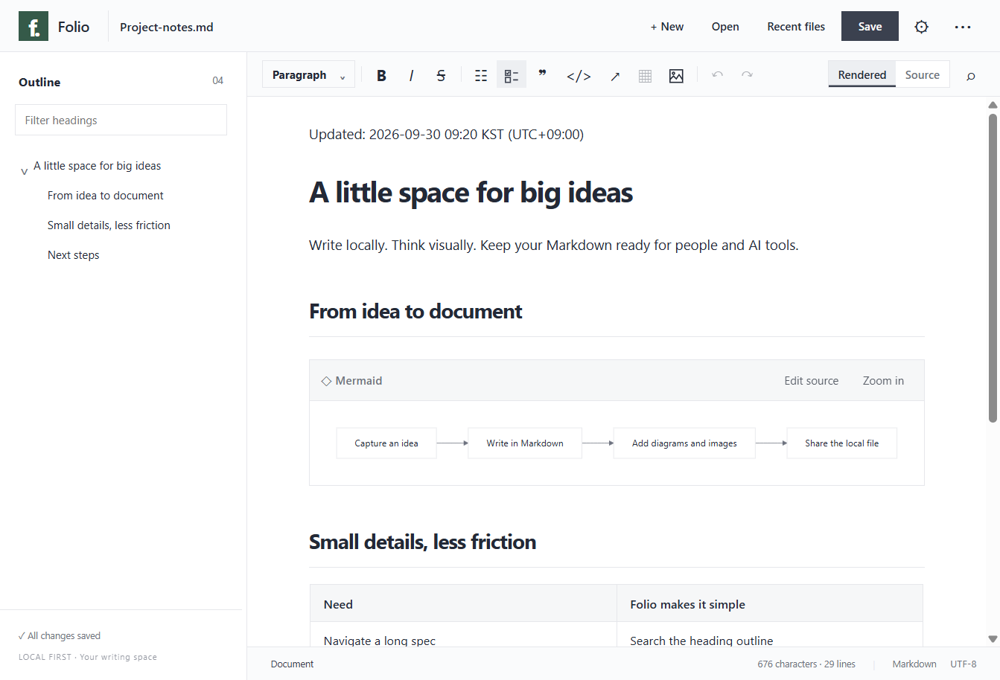
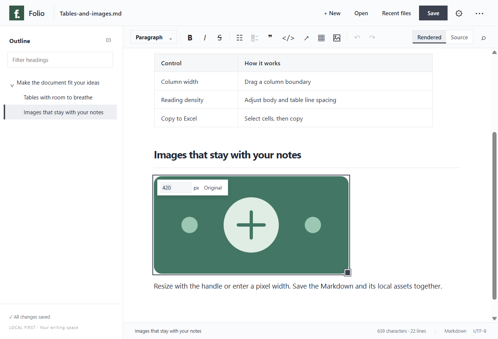
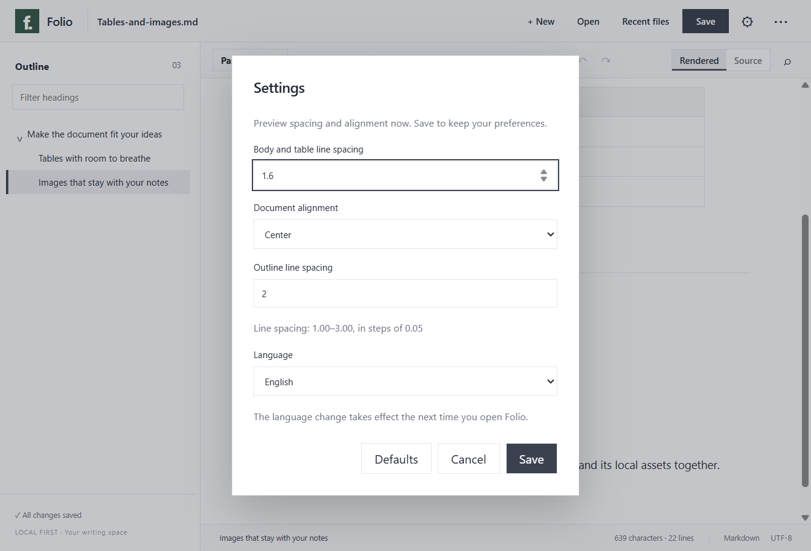
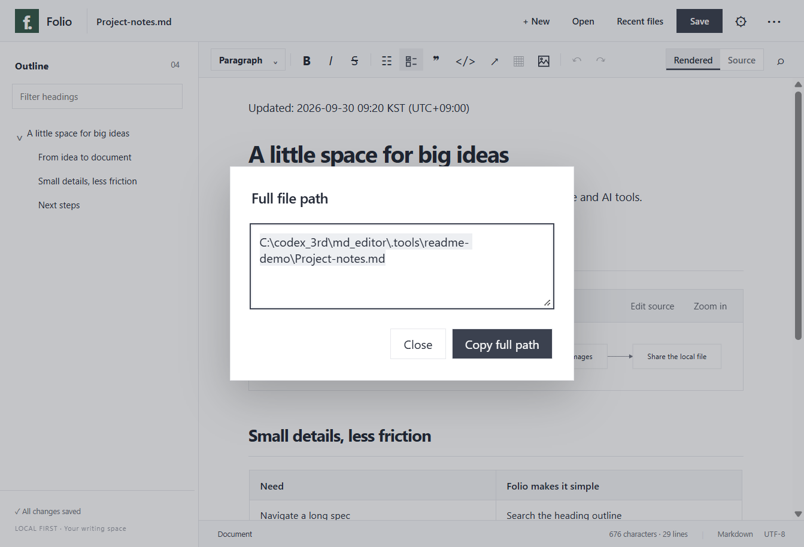
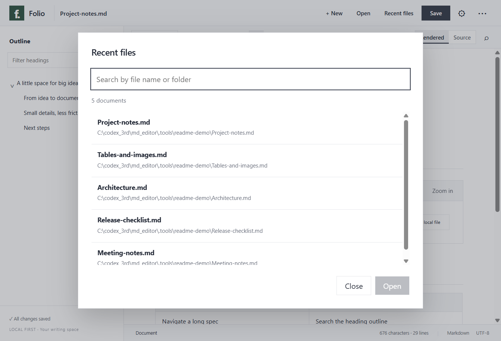

Updated: 2026-09-30 09:50 KST (UTC+09:00)

# Folio

**A lightweight Windows Markdown editor for everyday notes, visual documents, and AI-assisted work.**

Edit the document as you read it. Turn Mermaid code into diagrams, navigate by headings, adjust tables and images, and keep everything in local Markdown files.

**About 6.3 MB for the Windows x64 installer.** No account, server, or subscription is required for local editing.

[Download for Windows x64](https://github.com/bryan-white-1/folio/releases/download/v0.2.2/Folio-Setup-0.2.2-win-x64-online.exe) · [Release notes](https://github.com/bryan-white-1/folio/releases/tag/v0.2.2) · [Features](#features) · [Build from source](#build-from-source) · [Apache-2.0](LICENSE)

**Current release: 0.2.2** — a native Windows host, English and Korean interfaces, and a compact installer. See the [English release notes](RELEASE_NOTES.md) for changes since 0.1.11.



## Why Folio exists

Markdown is a natural home for project notes, specifications, and documents written with AI assistance. Working with those files should feel just as straightforward: read a diagram, find a section, make a table readable, resize a screenshot, and give an AI tool the exact path to the document.

Folio brings these everyday needs into a small, focused Windows app. Its purpose is to make local Markdown comfortable to read and edit, with practical details that save repeated trips to a file manager or a separate preview window. Your documents remain ordinary files you can keep in a project folder, track in Git, or use with other tools.

## Features

| Feature | What you can do |
| --- | --- |
| **Mermaid diagrams** | Render flowcharts, sequence, class, state, and entity relationship diagrams directly in your document. Jump to the source or open a larger view with 25–300% zoom and fit-to-width. |
| **Table spacing and column widths** | Drag column boundaries to resize them. Adjust the shared body/table line spacing from 1.00× to 3.00× with a live preview. Edit rows, columns, and alignment from the table's context menu. |
| **Markdown table of contents** | Navigate an automatic H1–H6 heading outline, including Setext headings. Search, collapse sections, jump to a heading, or rename it from the sidebar. |
| **Image resizing** | Select an image, drag its resize handle, or enter a pixel width. Restore its original size, undo changes, and keep custom widths after saving and reopening. |
| **Images saved with the document** | Insert image files or paste screenshots. Folio copies them to an adjacent `assets` folder; images in a new document are kept temporarily and copied on first save. Save As to another folder also copies referenced local images. |
| **Full file paths for AI workflows** | Click the filename to view and copy its absolute path, or right-click it to copy directly. Paste the path into a prompt for an AI tool that has access to your local files. |
| **20 recent files** | Reopen up to 20 recent documents with `Ctrl+Shift+O`. Search by filename or folder, see full paths, and resume work after restarting the app. |
| **Rendered and source editing** | Edit formatted Markdown directly or switch to the CodeMirror source editor with syntax highlighting, line numbers, and find/replace. |

### Tables and images, sized for the document

Make a narrow label column, give descriptions more room, and resize an image in place. Column widths and image sizes survive saving and reopening.



Use **Settings → Body and table line spacing** to adjust reading density. Outline spacing and left/center document alignment are configurable too. Spacing settings belong to the app; they do not change your Markdown content.



### Small conveniences that add up

- **Excel-friendly tables:** copy selected cells as formatted HTML or tab-separated text; paste a range into a new or existing table.
- **Checklists:** turn paragraphs or lists into tasks, toggle completion, and continue with Enter.
- **Find in the rendered document:** highlight matches in headings, tables, lists, and ordinary code blocks; jump forward or backward.
- **Shared undo/redo:** undo source, rendered, and heading-outline edits through one editing history.
- **Save and recovery support:** detect external changes, confirm save conflicts, and offer recovery from a snapshot recorded every three seconds while the document is modified.
- **English and Korean:** choose the interface language, with matching welcome content and bundled examples. Light and dark themes are available.
- **Windows integration:** optional Markdown file associations, an Explorer “Edit with Folio” command, and file opening in the existing app window.

<details>
<summary>See full-path copying and recent-file search</summary>

Click the filename to get the exact local path for your next prompt, script, or file reference.



Search recent documents by filename or folder; full paths distinguish files with the same name.



</details>

Screenshots show the 0.2.2 native app's English interface with sample documents.

## Lightweight by design

Folio uses a **C++/Win32 host and the shared Microsoft WebView2 Runtime**, with Milkdown, CodeMirror, and Mermaid inside the editor. The native package does not bundle .NET or Windows App SDK runtimes.

The `Folio-Setup-0.2.2-win-x64-online.exe` download is **about 6.3 MB**, including the editor, examples, and documentation. Exact bytes and SHA-256 checksums are supplied with the [release assets](https://github.com/bryan-white-1/folio/releases/tag/v0.2.2). A shared WebView2 installation is separate: if it is missing, the online installer downloads it during setup. Local document editing then works offline.

## Install

1. Download [Folio 0.2.2 for Windows x64](https://github.com/bryan-white-1/folio/releases/download/v0.2.2/Folio-Setup-0.2.2-win-x64-online.exe).
2. Run the installer and launch **Folio** from the Start menu. Folio installs per user without requiring administrator rights for the app.
3. Open a Markdown file, or explore **More → Example documents** in 0.2.2.

Windows 11 x64 is the primary tested environment. A portable ZIP is also supported; keep its files together and install [Microsoft WebView2 Runtime](https://developer.microsoft.com/en-us/microsoft-edge/webview2/) if needed. Current packages are unsigned, so Windows may show an unknown-publisher or SmartScreen notice.

To upgrade from 0.1.11, save your work, close Folio, and run the new installer. Documents, settings, and recovery data are preserved. See [installation and upgrade details](INSTALLER.md) for packaging, offline installers, file associations, and removal behavior.

## Quick start

| Action | Shortcut or control |
| --- | --- |
| New / Open | `Ctrl+N` / `Ctrl+O` |
| Recent files | `Ctrl+Shift+O` |
| Save / Save As | `Ctrl+S` / `Ctrl+Shift+S` |
| Rendered / Source | `Ctrl+Shift+M` |
| Find | `Ctrl+F` |
| Undo / Redo | `Ctrl+Z` / `Ctrl+Y` or `Ctrl+Shift+Z` |
| Body text / H1–H6 | `Ctrl+Alt+0` / `Ctrl+Alt+1`–`6` |
| Toggle a code block | `Ctrl+Alt+C` |
| Table editing menu | Right-click a cell or press `Shift+F10` |
| View and copy the file path | Click the filename in the app bar |

To add a diagram, write a fenced `mermaid` block in Source view and switch to Rendered:

````markdown

```mermaid
flowchart LR
    A[Idea] --> B[Markdown]
    B --> C[Diagram]
    C --> D[Share]
```
````

## Your files stay portable

Documents are UTF-8 `.md`, `.markdown`, or `.txt` files, with a 10 MB opening limit. Images are separate local assets, so keep the Markdown file and its `assets` folder together when sharing or moving a document.

Folio stores table widths and image sizes in adjacent `folio:table:v1` and `folio:image:v1` HTML comments. Other Markdown viewers can display the content at their default sizes; deleting the comments restores automatic sizing in Folio. Keep each comment next to its table or image.

Switching modes without editing preserves the document. Rendered edits may normalize Markdown punctuation and spacing; use Source view when exact Markdown syntax matters. Unsupported HTML, reference syntax, and front matter are preserved as source sections. External images are not loaded automatically; local images must be inside the document folder.

Settings and recent files live in `%LOCALAPPDATA%\Folio\settings.json`; recovery data lives in `%LOCALAPPDATA%\Folio\recovery.json`. Folio currently uses one document window, without document tabs or live collaboration. See the [functional specification](SPEC.md) for precise behavior and limits.

## Build from source

Use Windows x64, PowerShell (7 recommended), and Node.js 22.12+ or 24 with npm. The native build downloads and verifies its pinned C++ toolchain and WebView2 SDK. Installer builds also obtain Inno Setup; the first build needs an internet connection. Web UI tests use Microsoft Edge.

```powershell
git clone https://github.com/bryan-white-1/folio.git
cd folio

# Build, test, and create a portable ZIP plus the lightweight installer.
./build.ps1 -Zip -Installer

# Optional: include the full WebView2 installer for offline setup.
./build.ps1 -Installer -RuntimeMode Offline
```

Outputs are written to `artifacts/`. The default host is `src/Folio.Native`; the older C#/WinUI host remains available through `./build.ps1 -HostMode Legacy`.

For web development and focused checks:

```powershell
cd web
npm ci
npm run dev

# Run these separately from the development server.
npm test
npm run test:ui
```

See [native architecture and Windows integration checks](NATIVE_MIGRATION.md), [test results](TEST_RESULTS.md), and [installer validation](INSTALLER.md). Detailed engineering documents are currently maintained in Korean.

## License and feedback

Folio is open source under the [Apache License 2.0](LICENSE). Dependency notices are listed in [THIRD-PARTY-NOTICES.md](THIRD-PARTY-NOTICES.md). Bug reports and feature requests are welcome on [GitHub Issues](https://github.com/bryan-white-1/folio/issues).
