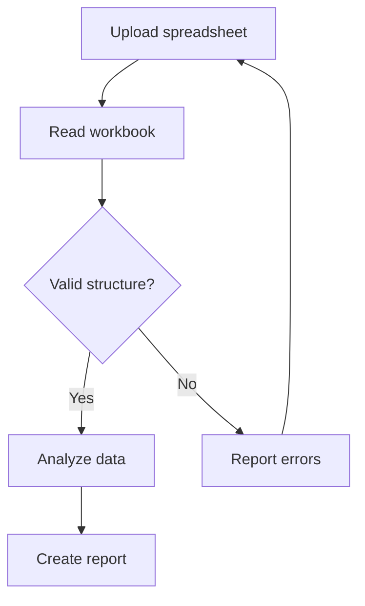
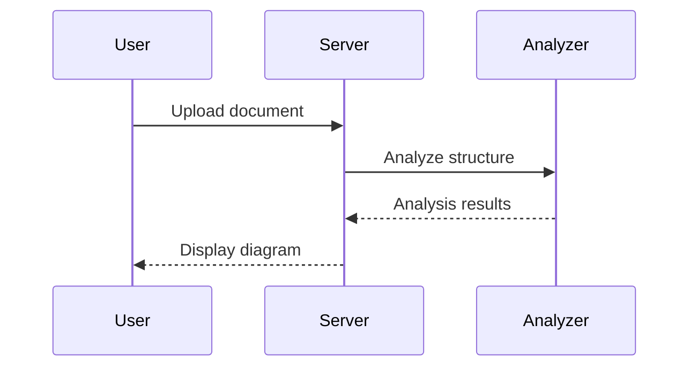
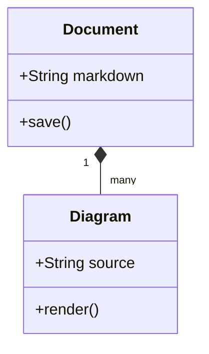
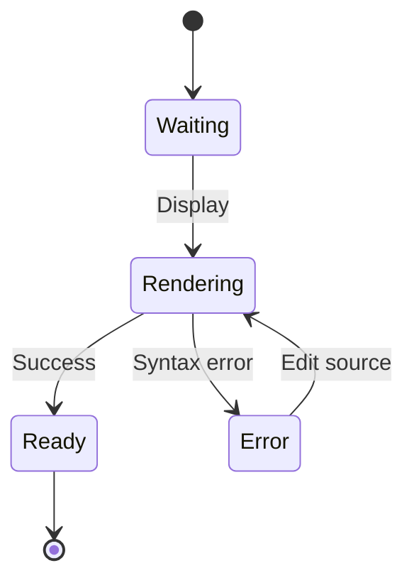
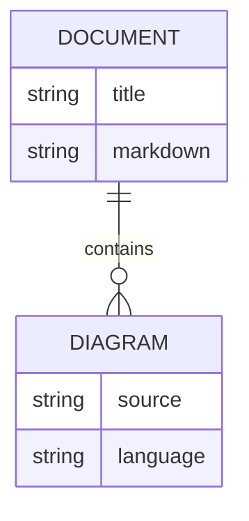

Updated: 2026-09-30 08:26 KST (UTC+09:00)

# Mermaid diagrams

Edit Mermaid syntax in Source view, then switch to Rendered to see the result. Use each card's **Edit source** and **Zoom in** buttons.

## Spreadsheet workflow

## Request and response

## Classes

## States

## Data relationships

