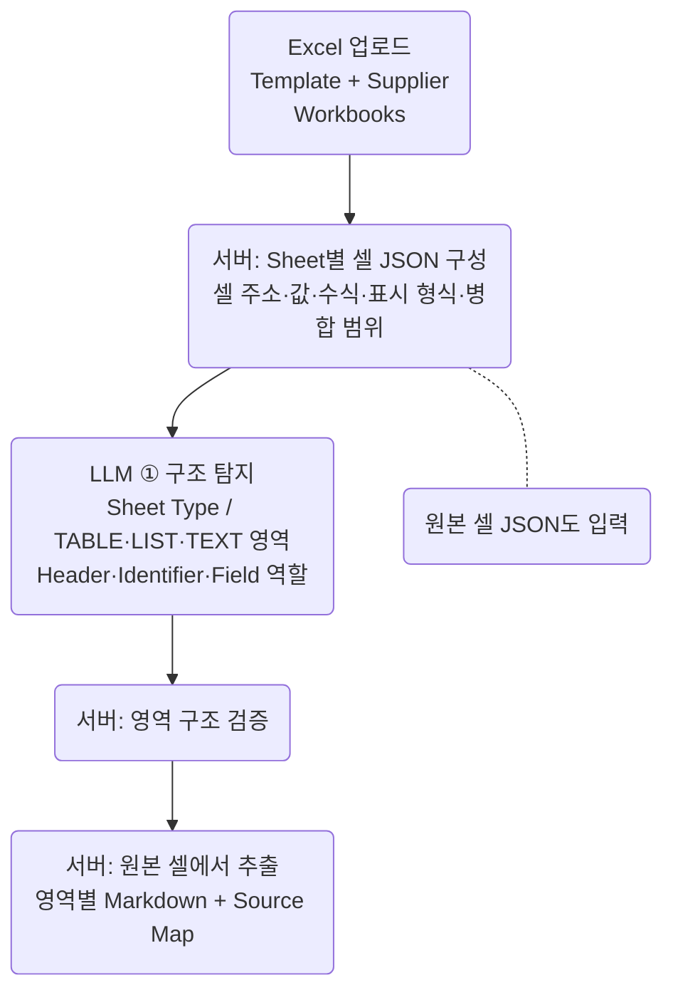
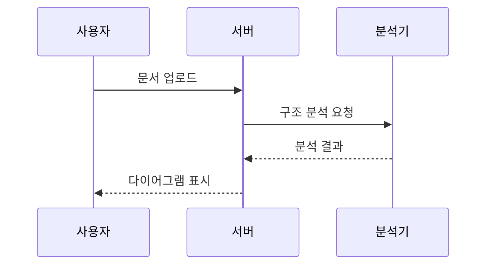
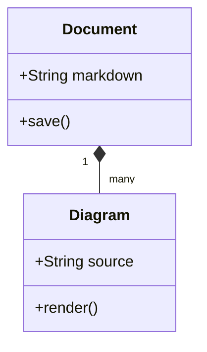
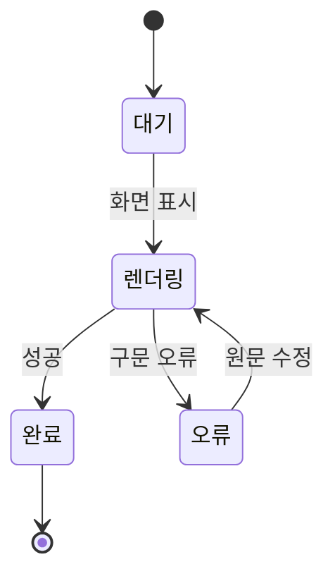
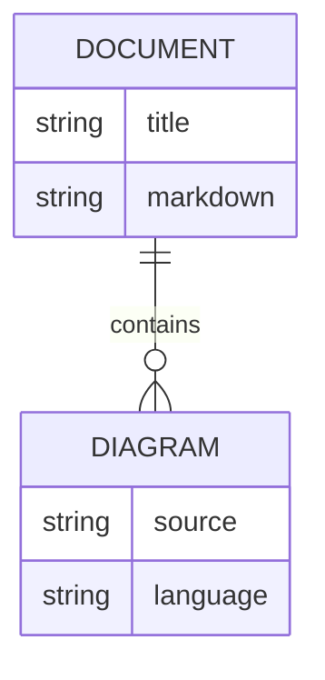

갱신: 2026-09-11 10:06:09 KST (UTC+09:00)

# Mermaid 다이어그램

원문 모드에서 Mermaid 구문을 수정하고 렌더링으로 전환하면 결과를 확인할 수 있습니다. 각 카드의 **원문 수정**·**확대** 버튼을 사용하세요.

## Excel 처리 흐름

## 요청과 응답

## 클래스

## 상태

## 데이터 관계

